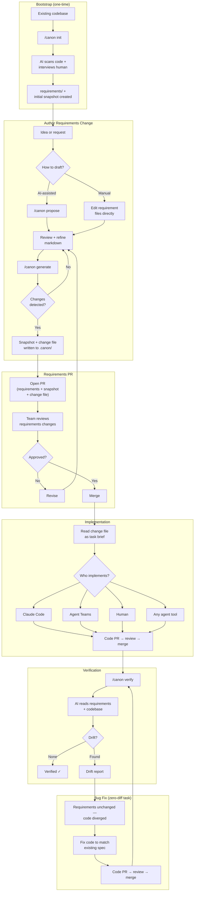
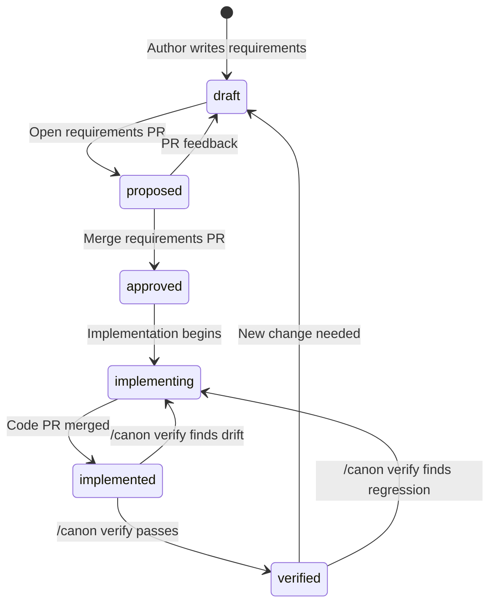
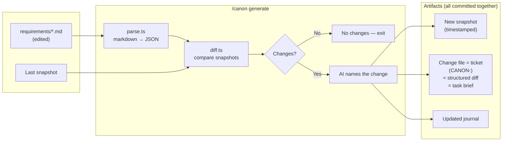
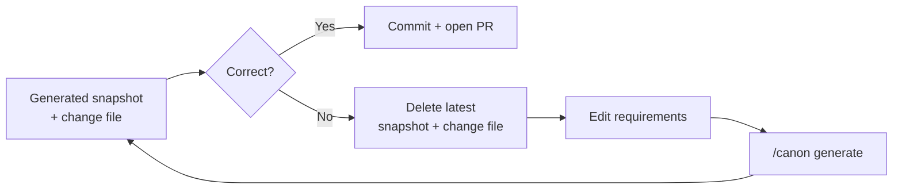

# Canon SDLC

## Overview

```mermaid
flowchart TB
    subgraph bootstrap ["Bootstrap (one-time)"]
        B1[Existing codebase] --> B2["/canon init"]
        B2 --> B3["AI scans code +\ninterviews human"]
        B3 --> B4["requirements/ +\ninitial snapshot created"]
    end

    subgraph change ["Author Requirements Change"]
        C1["Idea or request"] --> C2{How to draft?}
        C2 -->|AI-assisted| C3["/canon propose"]
        C2 -->|Manual| C4["Edit requirement\nfiles directly"]
        C3 --> C5["Review + refine\nmarkdown"]
        C4 --> C5
        C5 --> C6["/canon generate"]
        C6 --> C7{"Changes\ndetected?"}
        C7 -->|No| C5
        C7 -->|Yes| C8["Snapshot + change file\nwritten to .canon/"]
    end

    subgraph review ["Requirements PR"]
        R1["Open PR\n(requirements + snapshot\n+ change file)"] --> R2["Team reviews\nrequirements changes"]
        R2 --> R3{Approved?}
        R3 -->|No| R4["Revise"] --> C5
        R3 -->|Yes| R5["Merge"]
    end

    subgraph implement ["Implementation"]
        I1["Read change file\nas task brief"] --> I2{Who implements?}
        I2 --> I3["Claude Code"]
        I2 --> I4["Agent Teams"]
        I2 --> I5["Human"]
        I2 --> I6["Any agent tool"]
        I3 & I4 & I5 & I6 --> I7["Code PR → review → merge"]
    end

    subgraph verify ["Verification"]
        V1["/canon verify"] --> V2["AI reads requirements\n+ codebase"]
        V2 --> V3{Drift?}
        V3 -->|None| V4["Verified ✓"]
        V3 -->|Found| V5["Drift report"]
    end

    B4 --> C1
    C8 --> R1
    R5 --> I1
    I7 --> V1

    subgraph bugfix ["Bug Fix (zero-diff task)"]
        BF1["Requirements unchanged —\ncode diverged"] --> BF2["Fix code to match\nexisting spec"]
        BF2 --> BF3["Code PR → review → merge"]
        BF3 --> V1
    end

    V5 --> BF1
```

## Lifecycle States

```mermaid
stateDiagram-v2
    [*] --> draft: Author writes requirements

    draft --> proposed: Open requirements PR
    proposed --> draft: PR feedback
    proposed --> approved: Merge requirements PR

    approved --> implementing: Implementation begins
    implementing --> implemented: Code PR merged

    implemented --> verified: /canon verify passes
    implemented --> implementing: /canon verify finds drift

    verified --> draft: New change needed
    verified --> implementing: /canon verify finds regression
```

## Generate Flow

```mermaid
flowchart LR
    subgraph input [" "]
        MD["requirements/*.md\n(edited)"]
        LS["Last snapshot"]
    end

    subgraph generate ["/canon generate"]
        P["parse.ts\nmarkdown → JSON"] --> D["diff.ts\ncompare snapshots"]
        LS --> D
        D --> CHK{"Changes?"}
        CHK -->|No| SKIP["No changes — exit"]
        CHK -->|Yes| NAME["AI names the change"]
    end

    subgraph output ["Artifacts (all committed together)"]
        SNAP["New snapshot\n(timestamped)"]
        CF["Change file = ticket\n(CANON-<timestamp>)\n= structured diff\n= task brief"]
        JOURNAL["Updated journal"]
    end

    MD --> P
    NAME --> SNAP & CF & JOURNAL
```

## Correction Flow

```mermaid
flowchart LR
    A["Generated snapshot\n+ change file"] --> B{"Correct?"}
    B -->|Yes| C["Commit + open PR"]
    B -->|No| D["Delete latest\nsnapshot + change file"]
    D --> E["Edit requirements"]
    E --> F["/canon generate"]
    F --> A
```
